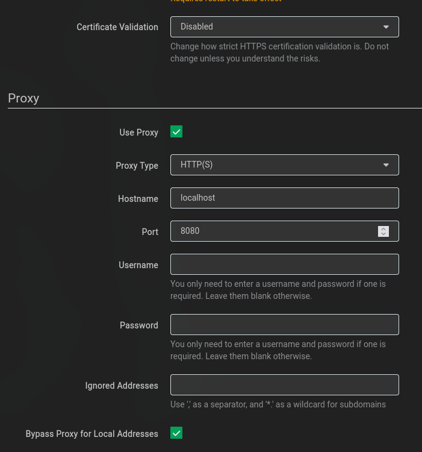

<div align="center">
<br />
<h1>Lidarr-Deemix</h1>
<h4><i>"Enrich Lidarr with Deezer metadata"</i></h4>

[](https://github.com/RiDDiX/lidarr-deemix/actions/workflows/container.yml)
[](https://github.com/RiDDiX/lidarr-deemix/releases)
[](https://github.com/RiDDiX/lidarr-deemix/pkgs/container/lidarr-deemix)

</div>

---

## 🎯 What it does

Lidarr uses MusicBrainz (via `api.lidarr.audio`) for artist/album metadata. However, MusicBrainz is often incomplete, especially for regional or niche artists.

**Lidarr-Deemix** acts as a transparent proxy that:
- Intercepts Lidarr's API requests to `api.lidarr.audio`
- Enriches the results with additional artists/albums from **Deezer**
- Returns combined results to Lidarr - no modifications to Lidarr needed!

## ✨ Features

- 🔍 **Enhanced Search** - Find artists/albums that MusicBrainz doesn't have
- 🎨 **Album Art** - Automatic cover images from Deezer
- 🔄 **Seamless Integration** - Works as a drop-in proxy, no Lidarr modifications
- 🐳 **Docker Ready** - Multi-arch images (amd64/arm64)
- ⚡ **Lightweight** - Alpine-based, minimal footprint

---

## 🚀 Quick Start

### Docker Compose (Recommended)

```yaml
services:
  lidarr-deemix:
    image: ghcr.io/riddix/lidarr-deemix:latest
    container_name: lidarr-deemix
    restart: unless-stopped
    ports:
      - "8080:8080"          # see the security note below
    environment:
      - DEEMIX_ARL=your_deezer_arl_token_here
    volumes:
      - ./config:/app/config
      - ./logs:/app/logs
```

> ⚠️ **Security note:** Port 8080 is an **anonymous HTTP forward proxy** (mitmproxy).
> `--allow-hosts` only limits what gets MITM-intercepted — CONNECT tunnels to arbitrary
> hosts are passed through. Never expose this port to the internet. If Lidarr runs on
> the same host, bind to localhost (`"127.0.0.1:8080:8080"`) or use an internal Docker
> network without publishing the port. Proxy authentication can be enabled via
> `MITM_EXTRA_ARGS=--proxyauth user:pass`.

### Get your Deezer ARL Token

1. Log into [deezer.com](https://www.deezer.com)
2. Open browser DevTools (F12) → Application → Cookies
3. Find the `arl` cookie and copy its value

---

## ⚙️ Configuration

### Environment Variables

| Variable | Default | Description |
|----------|---------|-------------|
| `DEEMIX_ARL` | - | **Required** for Deezer integration. Your Deezer ARL token |
| `MITM_PORT` | `8080` | External proxy port. **Note:** if you change this, you must also adjust the container port mapping (e.g. `"9090:9090"`) |
| `PRIO_DEEMIX` | `false` | Prioritize Deezer albums over MusicBrainz |
| `OVERRIDE_MB` | `false` | Use Deezer data only (ignores MusicBrainz; real MB artist IDs deliberately return 404) |
| `PREFER_SPECIAL_EDITIONS` | `false` | Prefer Deluxe/Extended editions over standard albums |
| `DEEMIX_MAX_ALBUMS` | `500` | Cap for Deezer album search results per artist refresh |
| `DEEMIX_URL` | `http://127.0.0.1:7272` | Deemix server URL (only change for external Deemix instances) |
| `LIDARR_URL` | - | Your Lidarr instance URL (improves artist matching for Deezer albums) |
| `LIDARR_API_KEY` | - | Your Lidarr API key (used together with `LIDARR_URL`) |
| `LOG_LEVEL` | `info` | Logging level (debug, info, warn, error) |
| `MITM_EXTRA_ARGS` | - | Extra arguments for mitmdump, e.g. `--proxyauth user:pass` |

### Lidarr Setup

1. Go to **Settings → General**
2. Configure proxy settings:
   - **Use Proxy:** ✅ Enabled
   - **Proxy Type:** HTTP(S)
   - **Hostname:** IP/hostname of lidarr-deemix container
   - **Port:** `8080`
   - **Bypass Proxy for Local Addresses:** ✅ Enabled
3. Set **Certificate Validation:** to `Disabled`
4. Click **Save**



### Spotify Integration

Lidarr's built-in **Spotify integration** (playlist imports, etc.) works automatically — no configuration needed. The proxy detects Spotify API requests (`/api/v0.4/spotify/*`) and passes them directly to `api.lidarr.audio` without interception.

---

## 🔧 Advanced Usage

### Without Deezer (MusicBrainz Proxy Only)

You can run without a Deezer ARL - it will just proxy MusicBrainz requests:

```yaml
environment:
  # No DEEMIX_ARL set - Deezer features disabled
```

### Override MusicBrainz Completely

Use only Deezer data (useful if MusicBrainz data is wrong):

```yaml
environment:
  - DEEMIX_ARL=your_arl
  - OVERRIDE_MB=true
  - LIDARR_URL=http://lidarr:8686
  - LIDARR_API_KEY=your_api_key
```

> ⚠️ **Warning:** This will remove all MusicBrainz-imported artists/albums!

---

## 📊 Architecture

```
                         Lidarr-Deemix Container
                    ┌─────────────────────────────────┐
┌─────────────┐     │  ┌───────────┐   ┌───────────┐  │     ┌─────────────────┐
│             │     │  │ mitmproxy │──▶│  Node.js  │──┼────▶│ api.lidarr.audio│
│   Lidarr    │────▶│  │  (:8080)  │   │  (:7171)  │  │     │   (MusicBrainz) │
│             │     │  └─────┬─────┘   └─────┬─────┘  │     └─────────────────┘
└─────────────┘     │        │               │         │
                    │        │          ┌────┴────┐    │
                    │  passthrough      │  Deemix │    │
                    │  (indexers,       │ (:7272) │    │
                    │   downloads,      └─────────┘    │
                    │   Spotify)                       │
                    └─────────────────────────────────┘
```

- **mitmproxy** — Only intercepts `api.lidarr.audio` and `ws.audioscrobbler.com`. All other traffic (indexers, download clients, notifications, Spotify) passes through as a clean TCP tunnel.
- **Node.js** — Enhances metadata API responses with Deezer data, proxies audioscrobbler.
- **Deezer API server** — Provides Deezer search and album/artist/track metadata via `deezer-py` (logged in with your ARL).

---

## 🐛 Troubleshooting

### Check container logs
```bash
docker logs lidarr-deemix
```

### Health check
```bash
# Docker built-in health status
docker inspect --format='{{.State.Health.Status}}' lidarr-deemix

# Or from inside the container
docker exec lidarr-deemix curl -sf http://localhost:7171/health
```

### Common issues

| Issue | Solution |
|-------|----------|
| "ARL invalid" | Get a fresh ARL token from Deezer |
| Connection refused | Check if port 8080 is exposed and accessible |
| No Deezer results | Verify DEEMIX_ARL is set correctly |

---

## 📝 Changelog

See [CHANGELOG.md](./CHANGELOG.md) for version history.

---

## 🙏 Credits

- Original project by [ad-on-is](https://github.com/ad-on-is/lidarr-deemix)
- [Deemix](https://deemix.app/) for Deezer integration
- [Lidarr](https://lidarr.audio/) for being awesome

---

## ☕ Support

> **This project is and will remain free and open source.**
> I maintain it in my spare time because I believe in open source.

If you find this project useful, consider supporting its development:

[](https://www.paypal.me/RiDDiX93)

Your support helps cover hosting costs and motivates continued development. Thank you! ❤️

---

## 📄 License

MIT License - see [LICENSE](./LICENSE) for details
